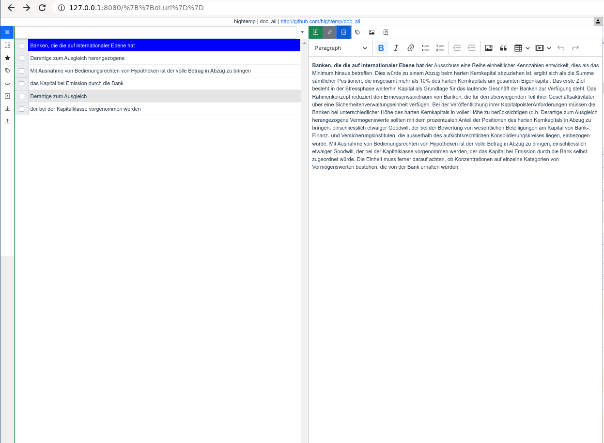

# wapp_github_blog_engine_vue

Движок для введения блога с использованием github api и github pages.

[DEMO](https://hightemp.github.io/wapp_github_blog_engine_vue)



## Project setup
```
npm install
```

### Compiles and hot-reloads for development
```
npm run serve
```

### Compiles and minifies for production
```
npm run build
```

### Customize configuration
See [Configuration Reference](https://cli.vuejs.org/config/).


